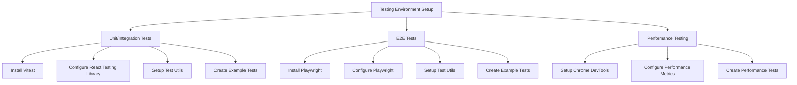

# Testing Environment Implementation Plan

## Overview

This document outlines the plan for implementing a comprehensive testing environment for the project, covering unit tests, integration tests, E2E tests, and performance testing.



## 1. Unit/Integration Tests Setup (Vitest + React Testing Library)

### Dependencies
```bash
vitest
@testing-library/react
@testing-library/jest-dom
@testing-library/user-event
happy-dom
```

### Configuration Files
- `vitest.config.ts` - Vitest configuration
- `test/setup.ts` - Global test setup
- `test/utils.ts` - Common testing utilities

### Test Structure
```
src/
  components/
    __tests__/         # Component tests
  lib/
    __tests__/         # Service tests
  pages/
    api/
      __tests__/       # API endpoint tests
```

## 2. E2E Tests Setup (Playwright)

### Dependencies
```bash
@playwright/test
```

### Configuration Files
- `playwright.config.ts` - Main configuration
- E2E directory structure:
  ```
  e2e/
    fixtures/         # Test data and utilities
    pages/           # Page object models
    specs/           # Test specifications
  ```

### Test Scenarios
- Navigation flows
- Form submissions
- API interactions
- Database operations

## 3. Performance Testing Setup

### Chrome DevTools Integration
- Lighthouse CI configuration
- Performance budgets
- Key metrics tracking

### Performance Test Scenarios
- Page load times
- Time to Interactive
- First Contentful Paint
- Memory usage

## 4. CI/CD Integration

### GitHub Actions Workflow Updates
```yaml
- Unit/Integration tests job
- E2E tests job
- Performance tests job
- Coverage reporting
```

### Reporting and Monitoring
- Test results aggregation
- Coverage reports
- Performance metrics tracking

## Implementation Order

1. Unit/Integration Testing Setup
   - Install Vitest and related dependencies
   - Configure test environment
   - Create initial test examples
   - Set up CI integration

2. E2E Testing Setup
   - Install Playwright
   - Configure test environment
   - Create page objects
   - Implement initial test scenarios

3. Performance Testing Setup
   - Configure Chrome DevTools integration
   - Set up performance metrics
   - Create baseline tests

4. CI/CD Integration
   - Update GitHub Actions workflows
   - Configure reporting
   - Set up monitoring